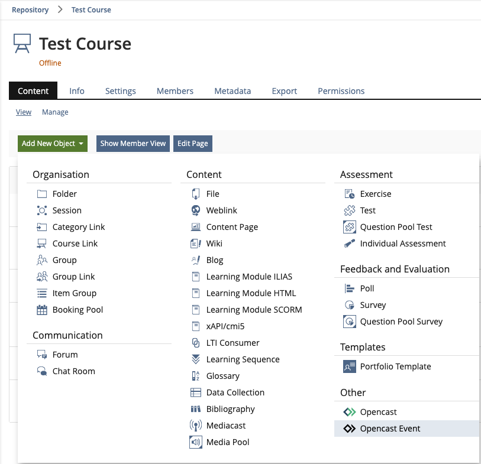
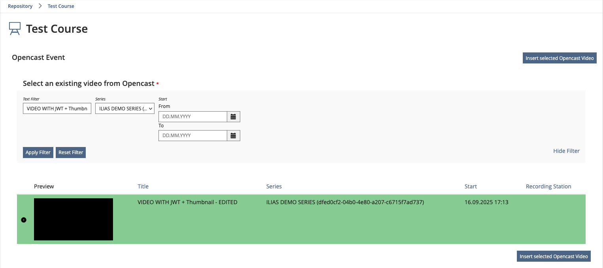
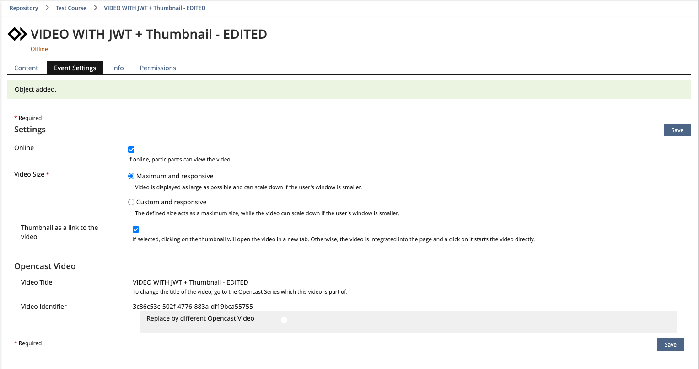
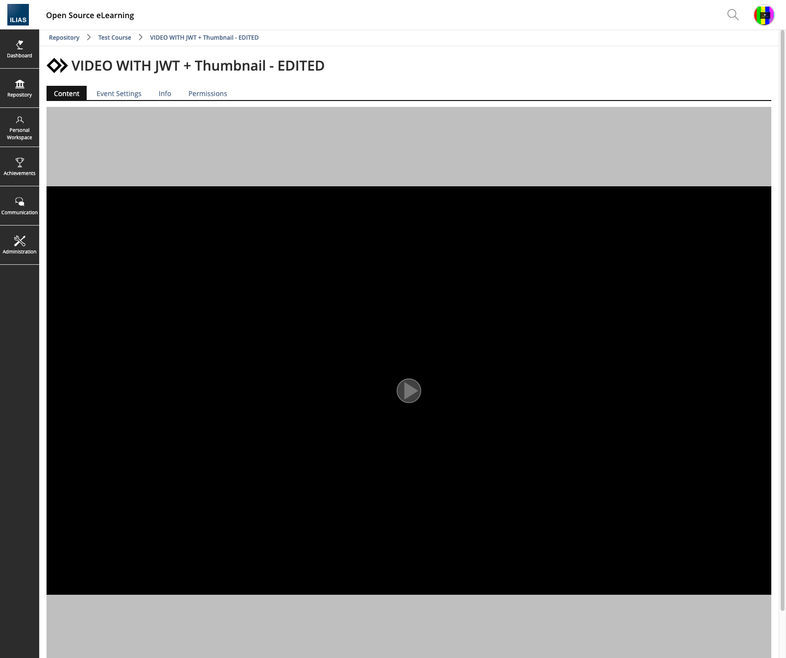

# Opencast Event Object

This repository plugin provides a single Opencast event as an individual repository object inside a course or group. It allows users to watch a specific video directly.

In contrast, the main Opencast repository plugin lists all videos within a series. This plugin focuses on displaying one selected event.

---

# Project Background

This Opencast plugin is developed and maintained collaboratively by the ILIAS Opencast community.

The original idea and first stable release were sponsored by the University of Cologne. Development and long-term maintenance are coordinated by elan e.V.

---

# Usage

The plugin enables course or group administrators to create an "Opencast Event" repository object. During creation, a table-based selection interface lists all accessible Opencast events. The selected event is then embedded and displayed using the Paella player.

The plugin depends on the main Opencast plugin for:

* Retrieving available events according to sorting and filters etc.
* Handling player integration

Repository:
[https://github.com/opencast-ilias/OpenCast](https://github.com/opencast-ilias/OpenCast)

---

# Getting Started

## Requirements

* ILIAS 9.x
* ILIAS Opencast Plugin (branch `release_9`)
* PHP version compatible with your ILIAS 9 installation

---

## Installation

From your ILIAS root directory:
```bash
mkdir -p Customizing/global/plugins/Services/Repository/RepositoryObject/
cd Customizing/global/plugins/Services/Repository/RepositoryObject/
git clone https://github.com/opencast-ilias/OpencastEvent.git
```

Return to the ILIAS root directory and run:

```bash
composer dump-autoload
php setup/setup.php install --plugin OpencastEvent
```

---

# Creating an Opencast Event Object

## 1. Add Repository Object

Add a new repository object of type "Opencast Event" to a course or group.



---

## 2. Select an Event

A list of available Opencast events is displayed. The table can be filtered by:

* Series
* Start date
* Title text

Select the desired event and complete the creation process.



---

## 3. Configure Object

After creation, you can:

* Set the object online/offline
* Configure permissions
* Adjust standard repository settings



---

## 4. View Event

If the user has sufficient permissions and the event is accessible, the embedded video player is displayed on the content page.


